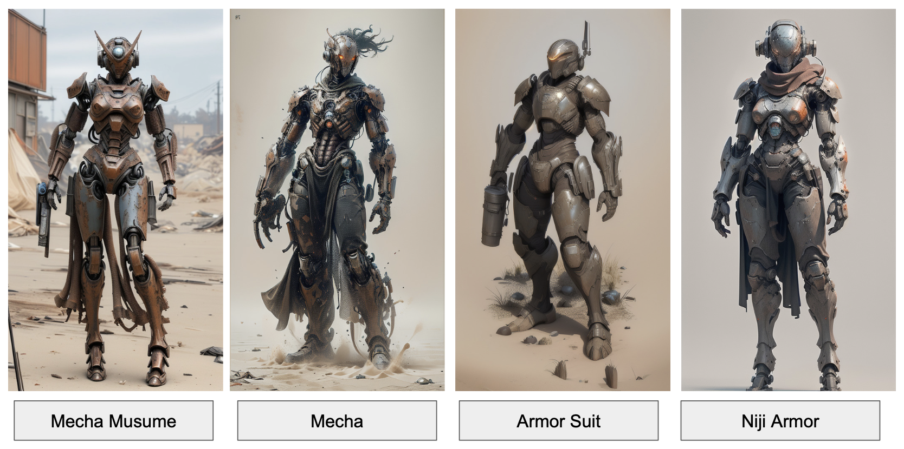

[](https://github.com/comfyanonymous/ComfyUI)
[](https://github.com/ltdrdata/ComfyUI-Manager)
[](https://github.com/kijai/ComfyUI-Hunyuan3DWrapper)
# ComfyUI-LoRA

**LoRA(Low-Rank Adaptation)** é forma leve de trinar modelos, adicionando pequenas mudanças em partes específicas. Isso deixa o treinamento mais rápido, consome menos memória e permite criar variações personalizadas do modelo, como ensinar ele a desenhar um estilo ou reconhecer um personagem específico. 

### Exemplo de LoRA
Abaixo estão 4 exemplos gerados com diferentes LoRA, com foco em gerar robôs:



|      LoRA      | Trigger Word       |
|----------------|--------------------|
| [Mecha Musume](https://civitai.com/models/15464/a-mecha-musume-a) | `mecha musume` `mechanical parts` `robot joints` `headgear`|
| [Mecha](https://civitai.com/models/76693?modelVersionId=697939)|     |
| [Armor Suit](https://civitai.com/models/59245/armor-suit-lora)| `armorsuit`    |
| [Niji Armor](https://civitai.com/models/99875/nijiarmor-lora-suits-armors-mechas)|     |


### Exemplo de workflow de LoRA
[Clique aqui para baixar o workflow de LoRA](./loRA-img2img.json)


# ComfyUI-3D

Mostra como utilizar o modelo **Hunyuan 3D** no **ComfyUI** para transformar uma **imagem 2D em um modelo 3D texturizado** de forma simples e visual.


### Exemplo de etapas para gerar 3D


### Requisitos
- ComfyUI
- Python 3.10+
- GPU com suporte a CUDA (recomendado)

  


### Instalação para gerar 3D
1. Abre custom_node dentro do diretório de ComfyUI:
   ```bash
   cd custom_nodes
2. Instalar Hunyuan 3D Wrapper:
   ```bash
   git clone https://github.com/kijai/ComfyUI-Hunyuan3DWrapper.git
   cd ComfyUI-Hunyuan3DWrapper
   pip install -r requirements.txt
3. Instalar custom rasterizer (pytorch e CUDA precisa ser compatível):
   ```bash
   cd hy3dgen/texgen/custom_rasterizer
   pip install .
4. Instalar o modelo [hunyuan3d-div-v2-0-fp16.safetensors](https://huggingface.co/Kijai/Hunyuan3D-2_safetensors/tree/main) dentro do `ComfyUI/models/diffusion_models`.
5. Dentro do ConfyUI instala o custom node [Essentials](https://github.com/cubiq/ComfyUI_essentials.git), se tiver ComfyUI-Manager instala através do **Install Missing Custom Nodes**.


   

### Workflow para gerar 3D
[Clique aqui para baixar o workflow para gerar modelo 3D](./Hunyuan3D-CG.json)

